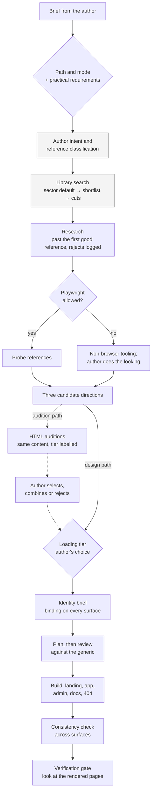
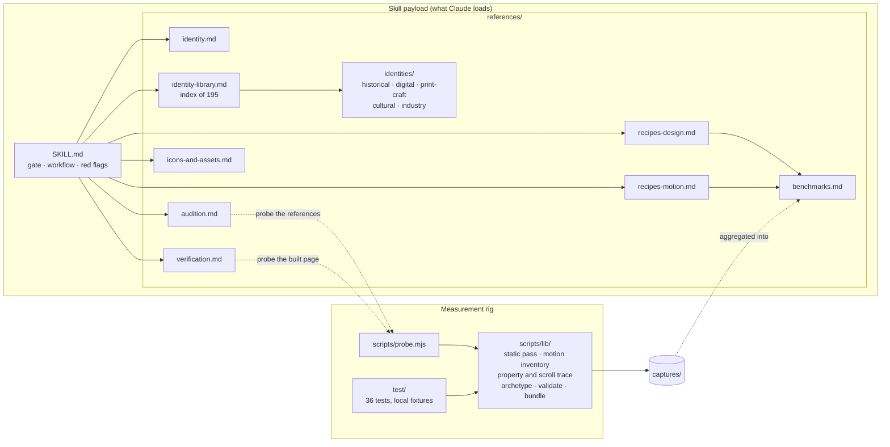

# df-design

A Claude Code skill for web design and motion, plus the measurement rig that
built it.

Most design guidance is taste asserted confidently. This is thirty production
sites loaded in a real browser and measured — and the prober that did the
measuring ships with it, so every number is reproducible and every claim is
checkable against a site you choose.

`SKILL.md` is the payload Claude loads. This README is for the human reading
the directory.

---

## Use the skill

Every run opens with two answers, declared before anything else happens:

```
path:  audition   # compare candidate identities as small HTML pages, choose, then build
       design     # build directly; the identity is still defined and written down first

mode:  motion     # animation only — identity is settled, not yours to change
       design     # identity and structure — no animation
       both       # a rebrand — identity first, then structure, then motion
```

That is not ceremony. The failure this skill exists to prevent is delivering a
finish-level change when someone asked for a structural one — new tokens and
type on the same layout, handed over as "a rebrand". If the request does not
make either answer obvious, Claude asks instead of guessing.

Path and mode are not generator switches. They select stages of one workflow:

```
Author intent → Identity definition → Reference & identity research
  → Playwright decision → Design direction → HTML audition → Author selection
  → Identity brief → Implementation → Consistency validation → Verification
```

A few rules run through all of it:

- **A reference is not an identity.** A link, a screenshot or a video shows
  what the project *could* be. Claude classifies what each reference
  demonstrates (layout, typography, interaction, an alternative presentation,
  and so on) and weighs it below the author's stated intent.
- **The identity library is the search engine.** `references/identity-library.md`
  indexes a gallery of named visual identities. Each has its grammar, what it
  says, fit, trap, loading cost, live sites that ship it, and search leads.
  Claude uses it to propose directions the author would not have reached, then
  researches past the first acceptable reference.
- **The approved identity binds every surface.** Landing, app, admin, DevOps,
  docs and 404 are one product. Density adapts; identity does not.
- **The author picks the loading tier.** Claude recommends the cheapest tier
  that fully delivers the identity, then offers fast, medium and high
  expensive loading, each described and costed for this project, plus a
  fourth "custom / unrestricted" choice if the author declines the
  recommendation. A heavier tier has to be justified in the identity brief.

In `both`, the order is fixed: **identity → structure → motion.** Motion
applied to a generic layout produces a generic layout that moves.

---

## Architecture

### The workflow

What happens in one run, and which file drives each stage. Dashed stages run
only on the audition path. In `motion` mode, the identity stages shrink to
reading the identity the site already has.



| Stage | File |
|---|---|
| Path and mode, red flags | `SKILL.md` |
| Intent, references, research, identity brief, consistency | `references/identity.md` |
| Library search | `references/identity-library.md` → `references/identities/*.md` |
| Playwright, auditions, loading tier | `references/audition.md` |
| Plan and build | `references/recipes-design.md`, `references/recipes-motion.md`, `references/icons-and-assets.md` |
| Verification | `references/verification.md` |

### The repository



The skill and the rig are separate halves. The skill tells Claude how to
work. The rig produced the numbers in `benchmarks.md`, and Claude runs it
during a job to measure reference sites and the page it built.

---

## Examples

Four briefs from different niches, each covering a different path and mode.
These are condensed from real runs of the skill on 2026-10-05. They were
dry runs: the agent planned up to the point of writing code and fetched no
URLs, so anything said about a reference site is a hypothesis it would
check with the prober first.

| | Niche | Path / mode | Reference supplied |
|---|---|---|---|
| Miolo | Food retail: sourdough bakery, Porto | audition / design | an AI-agent product page |
| Tracewell | B2B developer tool | design / motion | linear.app |
| Moreira & Vaz | Professional services: workers' law firm, Lisbon | design / design | gov.uk |
| Faísca | Culture and education: children's science museum | audition / both | a video of a toy brand's site |

### Miolo — a bakery that should feel like an old neighbourhood newsletter

> "I'm opening a small sourdough bakery in Porto called Miolo… landing page,
> online pre-order, a simple admin page for today's orders. I want it to
> feel like an old neighbourhood newsletter. This site shows another way of
> presenting a product that I like: hermes-agent.nousresearch.com"

- **Reference:** classed as PRESENTATION, not identity. Kept: "show the
  product working". The hero becomes tomorrow's loaves, how many are left
  and when orders close, instead of a bread photo. Its dark developer look
  is left behind.
- **Sector default to escape:** *Bakery / food shop*: darkened bread photo,
  "Welcome to…", slider, PDF menu.
- **Candidates:**
  - **A, closest:** a stencil-duplicated 1970s–80s parish bulletin. This is the specific reading of "newsletter"; the generic broadsheet was cut.
  - **B, the bakery's own world:** the kraft bread bag and the shop's price board.
  - **C, unexpected:** a teletext bulletin page with live counts.
- **Tier message:** fast expensive loading recommended (~150–200 KB). Medium
  and High stated honestly as adding nothing this style needs.
- **Plan:** duplicator-green paper, typed body text (Courier Prime) at
  64ch, lettering-guide caps, one violet stamp used only where a fact
  changes state (ESGOTADO, PAGO). Seven bands, each answering a real
  question. The admin is the bulletin's own ledger; the 404 is an
  "Errata".
- **Copy:** "O pão de amanhã encomenda-se hoje." Sold-out error: "A broa de
  milho esgotou para amanhã enquanto escolhia. O resto da sua encomenda
  está guardado."

### Tracewell — motion for a settled developer-tool brand

> "Open-source distributed tracing… settled brand: near-black, one
> signal-orange accent, Söhne + JetBrains Mono, 4px corners. The landing
> page feels dead. Add motion to the hero and 'how it works'. Keep it fast.
> Motion we admire: linear.app"

- **Identity:** motion mode, so the existing tokens are read and frozen.
  Palette, type, layout and radius are untouched.
- **Reference:** classed as INTERACTION only; the brand outranks it. Taken:
  the staggered dot grid, corner-glow masks, screen blends, a weighted
  curve. Left: Linear's palette, gradients and type.
- **Motion plan:** every move tied to a recipe in `recipes-motion.md`, and each one means something about tracing:
  - **Dot grid (§2):** dots fire like services emitting spans.
  - **Orange hairline (§5, §9):** one masked line crosses the hero like a request crossing services.
  - **Span waterfall (§10):** CSS `view()` draws the trace step by step as you scroll.
  - **Latency counter (§12):** counts to its real value in tabular mono.
- **Reduced motion (§14):** every element has a finished resting state, and the page works without JS.
- **Tier message:** fast (~1 KB of JS) recommended. Medium named a concrete
  extra (sticky scroll story, +30–40 KB). High named a live WebGL service
  graph (+150–300 KB, needs a fallback).

### Moreira & Vaz — a law firm on the workers' side

> "A 12-lawyer employment-law firm in Lisbon. We represent workers, not
> companies. Our current site looks like every other law firm: navy, a
> gavel, stock handshakes… homepage, a 'your rights at work' guide, intake
> form, 404. Here's a site I find clear: gov.uk"

- **Reference:** classed as LAYOUT and TYPOGRAPHY.
  - Taken: plain language, task-first headings, gov.uk's form pattern (error summary, inline errors).
  - Left: its look. A firm dressed as the state could be mistaken for an official body.
- **Sector default to escape:** *Legal / professional services*: navy,
  gavel, columns. The usual escape, institutional gravitas, also sides
  with institutions, so it was rejected too.
- **Library:** shortlist from four families. Nine cuts with reasons, e.g.:
  - **Constructivism:** reads as 1974 party politics in Portugal.
  - **Risograph:** "cheer feels trivial to someone just dismissed".
- **Chosen (design path):** *Field guide / almanac*, read specifically as
  a worker's pocket rights handbook. Entries are indexed by situation, with
  Labour Code article references in the margin.
- **Plan:** green-biased ink on paper, one bottle-green accent, Source Serif
  4 for display, Atkinson Hyperlegible Next for text at 19px / 66ch, and
  mono only for article numbers and deadlines. The one loud element is the
  hero's situation index: "Fui despedido(a)", "Não me pagaram".
- **Tier message:** fast (~120 KB). Medium and High: "nothing this identity
  needs".
- **Copy:** "Defendemos trabalhadores. Nunca empresas." Submit: "Enviar o
  meu caso". Error: "Escreva o que aconteceu, mesmo em poucas palavras".

### Faísca — rebrand and motion for a children's science museum

> "A hands-on science museum for kids 6–12 in Coimbra… homepage, ticket
> booking, a schools page, an internal front-desk bookings page, 404. Kids
> curious, parents feel it's worth the money, teachers trust it. I love the
> energy of this toy brand's bouncy site (video attached)."

- **Reference:** the video is classed as INTERACTION plus some INSPIRATION.
  - Taken: spring overshoot and motion that answers the pointer.
  - Left: the toy-shop palette and motion that never stops. Parents and teachers need calm.
- **Sector default to escape:** *Kids / family*: rainbow cartoon clutter.
- **Auditions:** the same content in all three ("Toca. Testa. Descobre."), each labelled with its tier:
  - **A, "Oficina Riso", closest:** Risograph spot inks with draggable exhibits.
  - **B, "Manual de Experiências", the museum's own world:** an experiment-sheet layout with numbered steps and line-art exploded diagrams.
  - **C, "Padrão Faísca", unexpected:** a Bauhaus grid with Nordic-style pattern bands drawn from magnetic field lines and crystals.
- **Motion for B:** "physics you could name in class". One spring curve
  that overshoots once (Hooke's law), cards that tip like a lever, steps
  that reveal in order like an experiment, and a slow pendulum.
  - **Reduced motion:** state changes become instant, the pendulum hangs at rest, and drag still works.
- **Surfaces:**
  - **Front-desk page:** the same manual grammar at desktop density, with no bounce.
  - **404:** "Experiência falhada", a manual page with a part missing from step 4.

---

## Run the prober

```
npm install
node scripts/probe.mjs https://linear.app --cohort analytics
```

Two passes over the page, and the second is the interesting one:

| Pass | `prefers-reduced-motion` | What it is for |
|---|---|---|
| Motion | `no-preference` | Static metrics, motion inventory, property trace, scroll trace, six scroll frames |
| Contract | `reduce` | Re-inventory and re-trace, to see what *actually* stopped moving |

That second pass is why the reduced-motion number in the benchmarks means
something. Grepping a stylesheet for `@media (prefers-reduced-motion)` tells
you a rule exists; re-running the property trace under `reduce` and counting
how many elements still move tells you whether it works. A site can ship the
media query and animate anyway.

Output lands in `captures/<site>/<date>/` — the validated record, the raw
capture, the motion traces, the frames, and a `contact.png` thumbnail grid
rendered by the browser that is already open.

### It quarantines rather than deletes

`scripts/lib/validate.mjs` separates suspect fields into a `quarantine` list
with a reason and keeps the raw capture as the authority. Nothing is silently
dropped, and nothing implausible is silently published:

- A page height under 1.5× the viewport on a site showing lazy-loading
  sentinels — measured too early, needs a scroll-to-bottom settle.
- A fully transparent accent or ground. `rgba(0,0,0,0)` is what you read off
  an element that never painted; publishing it as "the brand colour" is how a
  palette table fills up with black.
- Zero font faces on a page that rendered text.
- An absurd corner radius, unless it resolves to a pill — then it is
  normalised, not rejected.

An absent hero is legal and never quarantined. Some pages genuinely have no
`h1`, and a rig that treats that as an error cannot measure a canvas-first
site.

### Archetypes

`classifyArchetype()` sorts a page into `typographic`, `media-stage`,
`canvas`, `interactive-demo`, `editorial`, `none`, or `novel`. Order matters
in the classifier: a dominant visual stage outranks whatever type sits on top
of it. This keeps the aggregates honest — a 112px hero on a WebGL stage is
not evidence about typographic heroes.

```
npm test        # 36 tests, node:test, no network — a local fixture server
```

---

## What is in here

| Path | What it is |
|---|---|
| `SKILL.md` | The instruction payload: path and mode gate, workflow, headline numbers, verification gate, red flags. |
| `references/identity.md` | Author intent, reference classification and weighting, research depth, the identity brief, cross-surface consistency. |
| `references/identity-library.md` | Index of the identity gallery: the search engine for candidate directions. |
| `references/identities/` | The gallery itself, one file per family. |
| `references/audition.md` | The Playwright decision, HTML auditions, loading-cost tiers. |
| `references/icons-and-assets.md` | Commercially safe icon and asset sets, licence traps, sizing icons against type. |
| `references/benchmarks.md` | The measurements. Aggregates, per-site data, easing curves and durations actually shipped. |
| `references/recipes-design.md` | Ten sections: type roles and measure, colour ladders, page structure, chrome vocabulary, subject-derived identity, layout, anti-slop, the plan-and-review pass, words as design, and the checklist. |
| `references/recipes-motion.md` | Fourteen implementations, each traced to the site that ships it, ending in the reduced-motion contract. |
| `references/verification.md` | How to confirm the work is real. Read this one even if you skip the rest. |
| `scripts/probe.mjs` | The prober CLI. |
| `scripts/lib/` | Browser launch, static pass, motion inventory, property trace, scroll trace, archetype, validate, bundle. |
| `test/` | 36 tests and the HTML fixtures they run against. |

Claude reads the mode's recipe file and works from it; `benchmarks.md` and
`verification.md` are pulled in as needed.

---

## What the measurements say

The sample skews to data, analytics and developer tools: Stripe, Linear,
Vercel, ClickHouse, Hex, MotherDuck, Atlan, Datafold, Neon, Supabase, Warp,
Resend, Observable, PostHog, dbt, Grafana, Metabase, Tinybird, Monte Carlo,
Cube, WorkOS, VoidZero, Railway, Cerebrium, Fibery, Dovetail, Lovable,
Cosmos, Trionn, Infinite Machine.

| Measure | Production median | What gets shipped instead |
|---|---|---|
| Hero type size | **64px** | a 32–48px "large" heading |
| Hero tracking | **-0.025em** | `normal`, or a timid -0.01em |
| Page height | **9,329px** | under 3,000px — six thin bands |
| Distinct font faces | **5** | one neutral sans for everything |
| Ships a monospace face | **25 of 28** | none anywhere |
| Inter as the *display* face | **4 of 28** | Inter, because it is safe |
| CTA corner radius | **6px** | 12–16px, uniformly |

The most load-bearing finding is not in that table. Premium pages are not
built from more keyframes — they are built from **masks, clip paths and blend
modes**. Element counts using each: PostHog 164, Stripe 99, Fibery 94,
Cerebrium 85, Linear 54. A page with zero masks and zero blend modes reads as
flat no matter how carefully its fade durations are tuned.

---

## The verification gate

The skill will not call work done until the rendered page has been looked
at — not the test suite, not the type-checker, not the build. The page.

This is the part that earns its keep, because **absence is silent**. A class
that does not exist, a rule that never matches, a container that never
bounds: none of them raise anything. All of the following shipped green:

- A virtualized table that rendered all 1,386 rows, because the shell used
  `min-h-screen` and the scroll container never engaged. Three tests passed —
  they stubbed a 400px viewport.
- Five custom `fontSize` tokens that `tailwind-merge` deleted on sight,
  because it classifies unrecognised `text-*` as *colours*. The whole type
  scale was inert.
- 41 Tremor classes compiled to nothing, because the `tremor-*` namespace was
  never defined in the host Tailwind config. Every axis label fell back to
  Recharts grey — invisible on a dark canvas.
- A "rebrand" with 183 tests green in which not one structural decision had
  changed.

`references/verification.md` has the procedure: how to capture a page *at
rest* so scroll-triggered content is not photographed at `opacity: 0`, and
how to probe the page for what a screenshot cannot tell you — whether a theme
resolved, whether a virtualizer virtualized, whether a library's classes
compiled at all.

Note the inversion between the two halves of this repo. `verification.md`
emulates reduced motion to *suppress* animation, so a page can be
photographed at rest. The prober's first pass disables that emulation,
because there the animation is the measurement.

---

## Extending it

**Adding sites.** Run the prober; do not hand-edit a number into
`references/benchmarks.md`. When a capture contradicts the table, the capture
is the authority and the table is what needs editing — and `SKILL.md` repeats
several of these aggregates, so a median that no longer matches its source
table has to be updated in both places.

**Adding recipes.** They go in the mode's recipe file and must be **working
code traced to a named site that ships it**. A parameter table is not a
recipe. "Premium = 400ms, ease-out, no overshoot" is what produces
`opacity: 0 → 1` plus an 8px rise and a straight face — that is the failure
this skill was written against, and it creeps back every time a recipe gets
summarised instead of written out.

**Adding identities.** They go in the right family file under
`references/identities/` and get a row in the index. Each one needs a
grammar, a fit/misfit, a trap, a loading tier and at least one **live site that
ships it**. A style name with no grammar and no example is a mood word, and
mood words are what generic pages are built from.

**Adding to `verification.md`.** Each entry should have cost something to
learn. Every row in that file is a real failure that shipped past a green
suite; that is what makes it persuasive rather than preachy.

Design specs and implementation plans are gitignored on purpose — they are
working documents for whoever is driving a build, not part of the shipped
skill.
